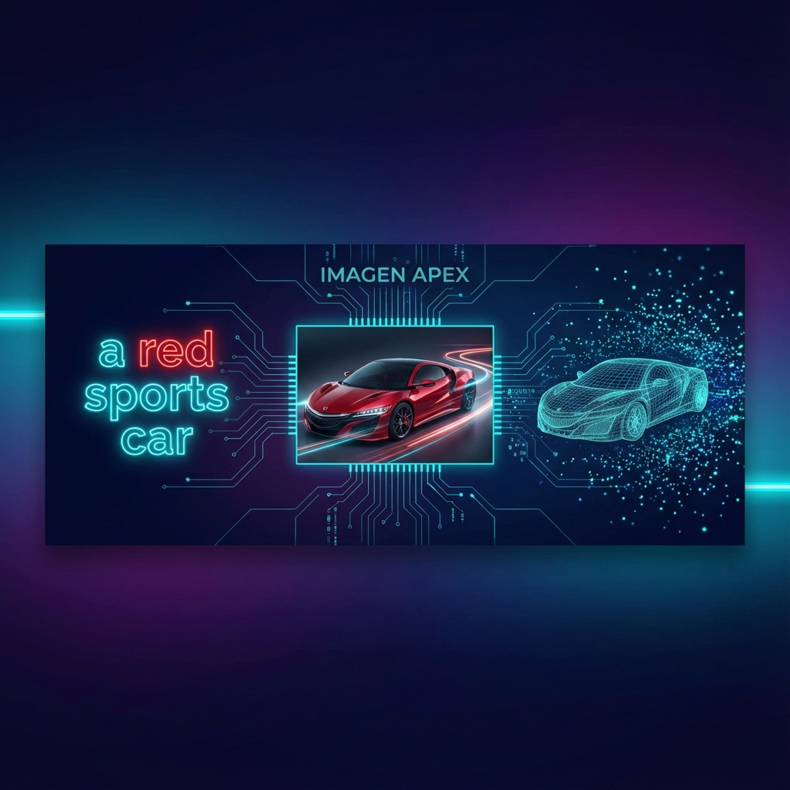

# Imagen Apex

<div align="center">



[](https://www.python.org/downloads/)
[](https://opensource.org/licenses/MIT)
[](https://cloud.google.com/vertex-ai)
[](https://youtu.be/LmJgkbapeJQ)

**Transform text into stunning 3D models using cutting-edge AI**

[Quick Start](#-quick-start) • [Features](#-features) • [Architecture](#-architecture) • [Examples](#-examples) • [Deployment](#-deployment)

▶️ **[Watch Demo on YouTube](https://youtu.be/LmJgkbapeJQ)**

</div>

---

## ✨ Features

- 🎨 **Nano Banana Pro** - Google's state-of-the-art image generation (Gemini-powered)
- 🔮 **SAM 3D Objects** - Meta's breakthrough image-to-3D reconstruction
- ⚡ **End-to-End Pipeline** - Text prompt → Generated Image → 3D Model in one command
- 🚀 **Cloud-Ready** - Deploy on Vertex AI or Cloud Run with GPU support
- 🔒 **Secure API** - Built-in API key authentication
- 📦 **Multiple Formats** - Export to PLY, GLB for use in Blender, Unity, etc.

---

## 🚀 Quick Start

### Prerequisites

- Python 3.11+
- Google Cloud account with billing enabled
- [HuggingFace account](https://huggingface.co) with access to [SAM 3D Objects](https://huggingface.co/facebook/sam-3d-objects)

### Installation

```bash
# Clone the repository
git clone https://github.com/lukehamond1001-alt/imagen-apex.git
cd imagen-apex

# Install dependencies
pip install -r requirements.txt

# Configure environment
cp .env.example .env
# Edit .env with your credentials
```

### Generate Your First 3D Model

```bash
# Text to 3D in one command
python -m src.pipeline --prompt "a red sports car" --output output/car.ply
```

---

## 🏗️ Architecture

```
┌─────────────────┐     ┌─────────────────┐     ┌─────────────────┐
│   Text Prompt   │ ──▶ │ Nano Banana Pro │ ──▶ │    Generated    │
│                 │     │   (Vertex AI)   │     │      Image      │
└─────────────────┘     └─────────────────┘     └────────┬────────┘
                                                         │
                                                         ▼
┌─────────────────┐     ┌─────────────────┐     ┌─────────────────┐
│    3D Model     │ ◀── │   SAM 3D API    │ ◀── │  Image + Mask   │
│   (PLY/GLB)     │     │ (Cloud Run/GPU) │     │                 │
└─────────────────┘     └─────────────────┘     └─────────────────┘
```

### Pipeline Flow

1. **Text Prompt** → User provides a description (e.g., "a wooden chair")
2. **Image Generation** → Nano Banana Pro creates a photorealistic image
3. **Object Masking** → Automatic segmentation of the main object
4. **3D Reconstruction** → SAM 3D converts the masked image to a 3D model
5. **Export** → Save as PLY or GLB for visualization/editing

---

## 📸 Examples

### Basic Usage

```python
from src.pipeline import TextTo3DPipeline

# Initialize the pipeline
pipeline = TextTo3DPipeline(
    project_id="your-gcp-project",
    sam3d_endpoint="https://your-sam3d-endpoint"
)

# Generate 3D model from text
result = pipeline.generate(
    prompt="a vintage wooden treasure chest",
    output_path="output/chest.ply"
)

print(f"✅ 3D model saved: {result['ply']}")
print(f"📷 Source image: {result['image']}")
```

### Command Line

```bash
# Generate from text prompt
python -m src.pipeline --prompt "a ceramic coffee mug" --output mug.ply

# Use an existing image
python -m src.pipeline --image my_photo.jpg --output model.ply

# Image generation only
python -m src.image_generator --prompt "a golden crown" --output crown.png
```

---

## 🚢 Deployment

### Option 1: Cloud Run with GPU (Recommended)

```bash
# Deploy SAM 3D server to Cloud Run
python deploy/deploy_cloudrun.py \
    --project your-project-id \
    --region us-central1 \
    --hf-token $HF_TOKEN
```

### Option 2: Vertex AI Endpoint

```bash
# Deploy to Vertex AI
python deploy/deploy_vertex.py \
    --project your-project-id \
    --region asia-east1 \
    --hf-token $HF_TOKEN
```

### Option 3: Local with Docker

```bash
# Build and run locally
cd server
docker build -t imagen-apex-sam3d --build-arg HF_TOKEN=$HF_TOKEN .
docker run --gpus all -p 8080:8080 imagen-apex-sam3d
```

---

## 💰 Cost Estimation

| Resource | Cost |
|----------|------|
| Nano Banana Pro (Image Generation) | ~$0.04/image |
| Cloud Run GPU (L4) | ~$0.75/hour |
| Vertex AI GPU (V100) | ~$2.50/hour |
| Vertex AI GPU (A100 40GB) | ~$3.50/hour |

> 💡 **Tip**: Use `python deploy/deploy_vertex.py --undeploy` to stop your endpoint when not in use.

---

## 📁 Project Structure

```
imagen-apex/
├── src/                    # Core pipeline code
│   ├── pipeline.py         # Main orchestration
│   ├── image_generator.py  # Nano Banana Pro client
│   ├── sam3d_client.py     # SAM 3D API client
│   └── utils.py            # Helper functions
├── server/                 # SAM 3D server container
│   ├── Dockerfile
│   └── handler.py
├── frontend/               # React web interface
│   ├── App.tsx             # Main React component
│   ├── components/         # UI components
│   ├── services/           # API integrations
│   └── README.md           # Frontend documentation
├── deploy/                 # Deployment scripts
│   ├── deploy_vertex.py
│   └── deploy_cloudrun.py
├── examples/               # Usage examples
└── docs/                   # Documentation
```

---

## 🔧 Configuration

Create a `.env` file based on `.env.example`:

```bash
# Google Cloud
GCP_PROJECT_ID=your-project-id
GCP_REGION=us-central1

# SAM 3D Endpoint
SAM3D_ENDPOINT=https://your-endpoint-url
SAM3D_API_KEY=your-api-key

# HuggingFace (for model downloads)
HF_TOKEN=your-huggingface-token
```

---

## 🐛 Troubleshooting

<details>
<summary><strong>"Endpoint not found"</strong></summary>

Deploy the SAM 3D server first:
```bash
python deploy/deploy_cloudrun.py --hf-token $HF_TOKEN
```
</details>

<details>
<summary><strong>"Model server never became ready"</strong></summary>

- Verify your HuggingFace token has access to [facebook/sam-3d-objects](https://huggingface.co/facebook/sam-3d-objects)
- Check your GPU quota in the GCP Console
</details>

<details>
<summary><strong>"CUDA out of memory"</strong></summary>

- Images are automatically resized to 256x256 for L4 GPUs
- Use a larger GPU (V100/A100) for higher resolution
</details>

---

## 🤝 Contributing

Contributions are welcome! Please see [CONTRIBUTING.md](CONTRIBUTING.md) for guidelines.

---

## 📄 License

This project is licensed under the MIT License - see the [LICENSE](LICENSE) file for details.

---

## 🙏 Acknowledgments

- [Google Cloud Vertex AI](https://cloud.google.com/vertex-ai) - Nano Banana Pro image generation
- [Meta Research](https://github.com/facebookresearch/sam-3d-objects) - SAM 3D Objects model
- [HuggingFace](https://huggingface.co) - Model hosting and distribution

---

<div align="center">
<strong>Made with ❤️ by Luke Hamond</strong>
</div>
